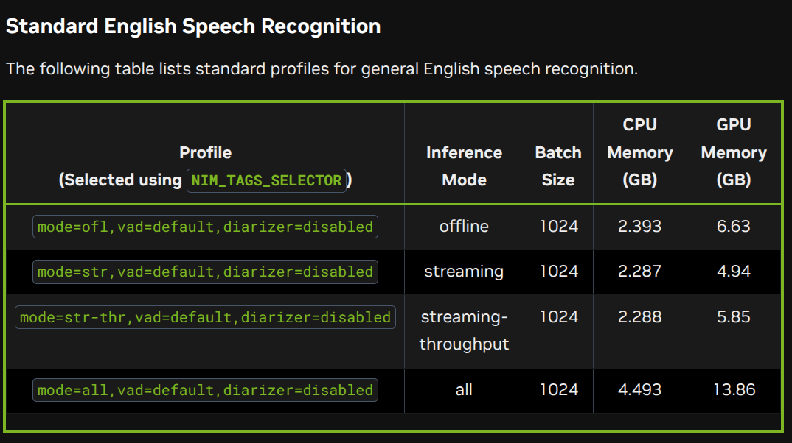
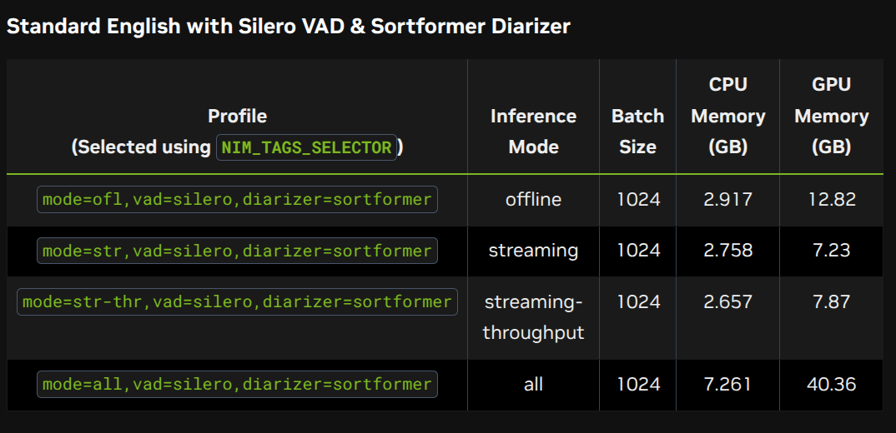

# NVIDIA NIM Riva ASR 1.8.0

This repository provides a Docker Compose setup for running NVIDIA NIM Riva ASR.

*Tested on a machine with NVIDIA GeForce RTX 5080.*

## Prerequisites

Install `ydotoold` for automation support:
```bash
sudo apt install ydotoold
```

## Setup

### 1. Configure Environment
Create or edit the `.env` file and set your `NGC_API_KEY`.

### 2. Prepare Directories
Create the cache directory on the host machine:
```bash
mkdir -p ~/.cache/nim
chmod 777 ~/.cache/nim
```

### 3. Start the Server
```bash
docker compose up
```

## Usage

### Start the Client
After the server has fully started, run the client:
```bash
uv run direct_dictation.py
```

## Configuration Notes

- **VAD & Diarization**: If background noise (like a fan) is affecting performance, try using `vad=silero`. Note that `vad=silero` must be used with `diarizer=sortformer`.
- **Model Type**: Avoid using `model_type=prebuilt` as it may trigger the DGX Spark version.



*Standard English with Silero VAD & Sortformer Diarizer*


## Maintenance

### Clear Cache & Models
To force a fresh build or manifest sync:
```bash
# Clear the compiled model directory
rm -rf ~/03_Exp/nim-asr/riva-models/*

# Clear the RMIR cache
rm -rf ~/.cache/nim/*
```

### Inspect Models
To check the models inside the container:
```bash
docker exec -it parakeet-1-1b-ctc-en-us ls -R /data/models
```


